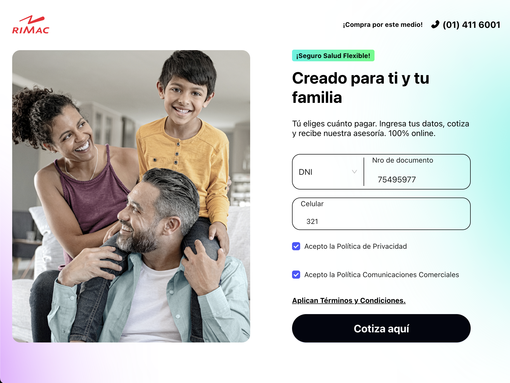

# 🛒 Rimac Front-end Challenge: Get a quote for your Rimac insurance.

This is a web application that simulates the process of getting a quote for your Rimac insurance. It allows you to register, view plans, and resume.

 <div style="text-align: center"> 

</div>

## 🚀 How to Run the Project

### 1. Clone the repository

```bash
git clone https://github.com/aireck2/rimac-front-challenge.git
```

### 2. Install dependencies

```bash
pnpm install # or npm install
```

### 4. Run the application

Simply run:

```bash
pnpm dev # or npm run dev
```

## 💻 Features

- Register: You can register entering document type, document number, phone number.
- View plans: You can view all available plans.
- Resume: You can view your resume.

## 🛠️ Tech used

- **React + Vite**
- **TypeScript**
- **Wouter** (router)
- **Zustand** (global state)
- **Ant Design** (UI components)
- **CSS**

## 👨‍💻 Author

- [Erick Escriba | @Aireck2](https://github.com/Aireck2)

This is an educational project created as part of a final assignment.
